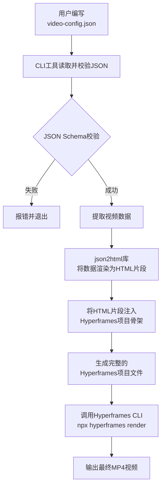

以 `json2html` 库为基础，项目的实现流程可以清晰地分为几个阶段。其核心思路是利用 `json2html` 将用户的 JSON 数据转换为 HTML 字符串，然后将其嵌入到 Hyperframes 视频项目的 HTML 骨架中。

下面是一个具体的实现流程图和步骤拆解。

### 🗺️ 项目实现流程图



### 📝 详细步骤拆解

**1. 定义 JSON Schema 与创建模板**

这是准备阶段，需要定义好数据格式和展示样式。

*   **定义 JSON Schema**：你需要设计并规范用户 JSON 文件的结构。例如，定义好 `title`、`scenes`（场景列表）、每个场景的 `duration`（时长）和 `elements`（元素列表）等字段。这个 Schema 随后会用于校验。
*   **创建 Hyperframes HTML 骨架**：创建一个标准的 Hyperframes 项目 `index.html`。这个文件是视频的“骨架”，但内容是动态的。你需要在其中留出“插槽”，比如用一个 `<div id="content"></div>` 来承载由 JSON 动态生成的内容。

**2. 核心转换逻辑 (The "JSON to HTML" Engine)**

这是项目的核心，负责将用户输入的 JSON 数据转换为最终的 HTML 文件。

*   **读取与校验**：CLI 工具读取用户的 `video-config.json` 文件，并根据第一步定义的 Schema 进行校验，确保数据格式正确。
*   **数据到 HTML 的转换**：这是 `json2html` 库发挥作用的地方。你需要编写一个转换函数，核心逻辑是：
    *   遍历 JSON 中的 `scenes` 和 `elements` 数据。
    *   根据元素类型（如 `text`、`image`），使用 `json2html` 将其渲染为对应的 HTML 字符串。例如，一个标题元素 `{ "type": "text", "content": "Hello", "style": "title" }` 会被渲染成 `<h1 class="title">Hello</h1>`。
    *   将所有渲染好的 HTML 片段组合成一个完整的、描述视频内容的 HTML 字符串。
*   **组装最终文件**：将上一步生成的 HTML 内容字符串，注入到 Hyperframes HTML 骨架的预留“插槽”（如 `#content`）中，从而生成一个完整的、可被 Hyperframes 渲染的 `index.html` 文件。

**3. 集成 Hyperframes 渲染管道**

生成完整的 `index.html` 后，剩下的工作就是调用 Hyperframes 的工具来完成视频渲染。

*   **预览**：为了便于调试，你可以提供预览功能。在生成 `index.html` 后，自动运行 `npx hyperframes preview` 命令，让用户能在浏览器中实时查看和调整视频效果。
*   **渲染**：这是最后一步。当用户对预览效果满意后，执行 `npx hyperframes render` 命令。Hyperframes 会启动一个无头浏览器（Headless Browser）来“录制”你的 HTML 页面，将其逐帧截图并最终通过 FFmpeg 编码成 MP4 视频文件。

**4. (可选) 封装为友好的 CLI 工具**

为了提升用户体验，你可以用 Commander.js 或 Yargs 等库，将上述所有逻辑封装成一个命令行工具（CLI）。用户最终的操作会非常简便：

```bash
# 1. 用户编写好 video-config.json 文件
# 2. 运行一条命令，完成从 JSON 到 MP4 的全部过程
my-video-tool render video-config.json --output my-video.mp4
```

### 💎 总结与关键技术点

整个流程可以概括为：**`JSON数据` -> (`json2html`转换) -> `HTML内容` -> (注入骨架) -> `完整HTML文件` -> (`hyperframes`渲染) -> `MP4视频`**。

这个过程中，有两个关键的技术点需要你特别关注：
1.  **`json2html` 模板设计**：你需要为 `json2html` 设计好模板，使其能正确地将 JSON 数据结构映射为结构化的 HTML。这部分工作决定了视频内容的呈现方式。
2.  **Hyperframes `@hyperframes/core` 库**：除了直接生成 HTML 文件，Hyperframes 官方也提供了 `@hyperframes/core` 这个核心库。它包含了用于“从数据生成合成 HTML”的工具，可以直接在 Node.js 环境中调用，这可能比手动拼接字符串更强大、更可靠，值得在你的项目中进行调研和使用。